# HyTIP: Hybrid Temporal Information Propagation for Masked Conditional Residual Video Coding

[Our paper](https://arxiv.org/abs/2508.02072) has been accepted to ICCV 2025. This repository contains the source code for HyTIP.

Please note that we have optimized the training procedure and enhanced HyTIP’s performance beyond the results reported in the ICCV paper. Updated results are available in this repository and arXiv paper.


## Abstract

> Most frame-based learned video codecs can be interpreted as recurrent neural networks (RNNs) propagating reference information along the temporal dimension. This work revisits the limitations of the current approaches from an RNN perspective. The output-recurrence methods, which propagate decoded frames, are intuitive but impose dual constraints on the output decoded frames, leading to suboptimal rate-distortion performance. In contrast, the hidden-to-hidden connection approaches, which propagate latent features within the RNN, offer greater flexibility but require large buffer sizes. To address these issues, we propose HyTIP, a learned video coding framework that combines both mechanisms. Our hybrid buffering strategy uses explicit decoded frames and a small number of implicit latent features to achieve competitive coding performance. Experimental results show that our HyTIP outperforms the sole use of either output-recurrence or hidden-to-hidden approaches. Furthermore, it achieves comparable performance to state-of-the-art methods but with a much smaller buffer size, and outperforms VTM 17.0 (Low-delay B) in terms of PSNR-RGB and MS-SSIM-RGB. The source code of HyTIP is available at [https://github.com/NYCU-MAPL/HyTIP](https://github.com/NYCU-MAPL/HyTIP).


## Complexity-performance Trade-offs

* Comparison of complexity-performance trade-offs between HyTIP and state-of-the-art methods. The vertical axis shows the BD-rate savings in terms of PSNR-RGB, evaluated with VTM-17.0 (Low-delay B) serving as the anchor. The horizontal axes represent the complexity metrics, including temporal buffer size, model size, and kMAC/pixel for encoding and decoding.

<p align="center">
    
</p>


## RD Performance

* PSNR-RGB in BT.601
<p align="center">
    
    
    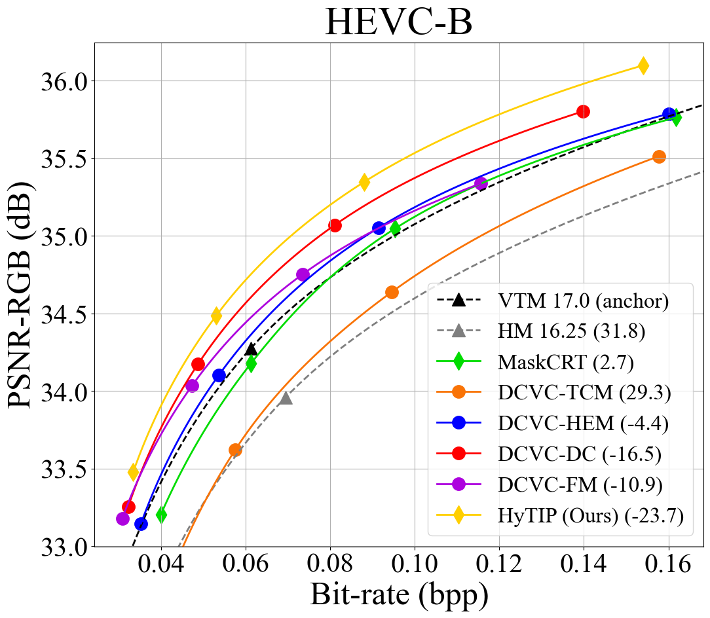
    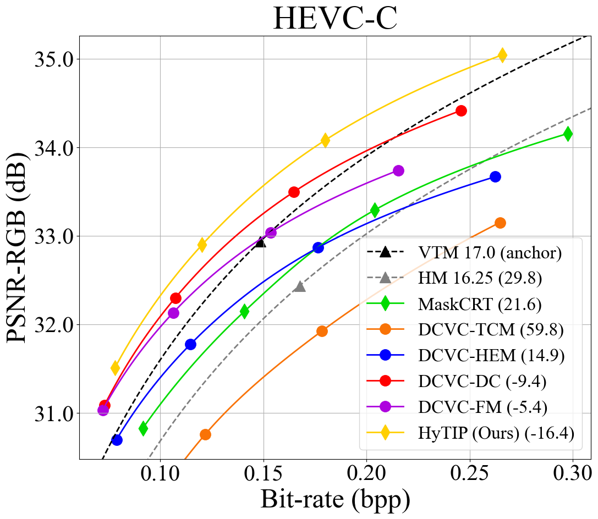
    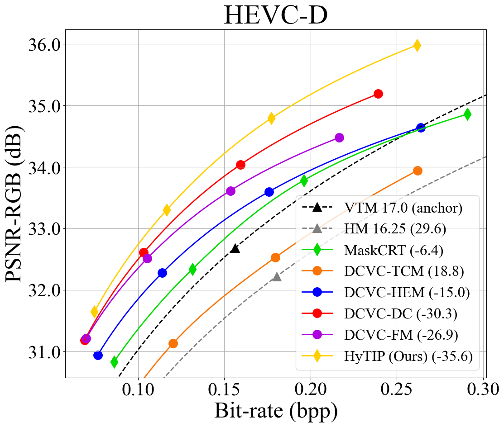
    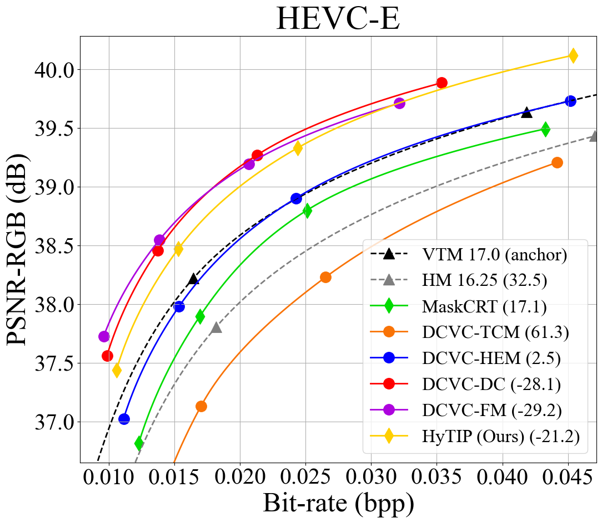
    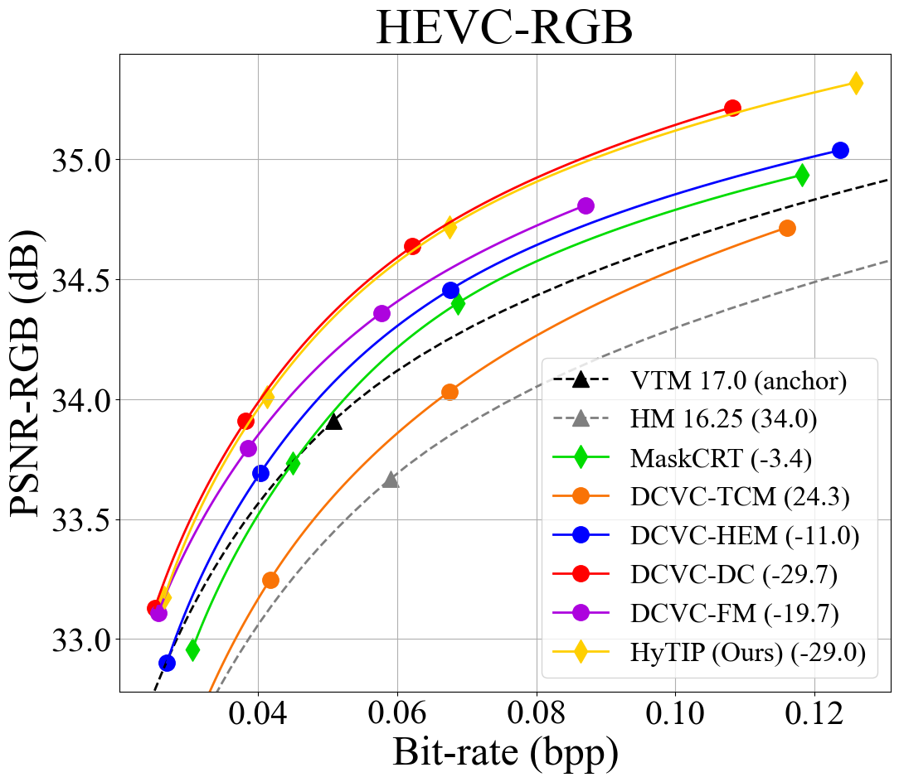
</p>

* PSNR-RGB in BT.709
<p align="center">
    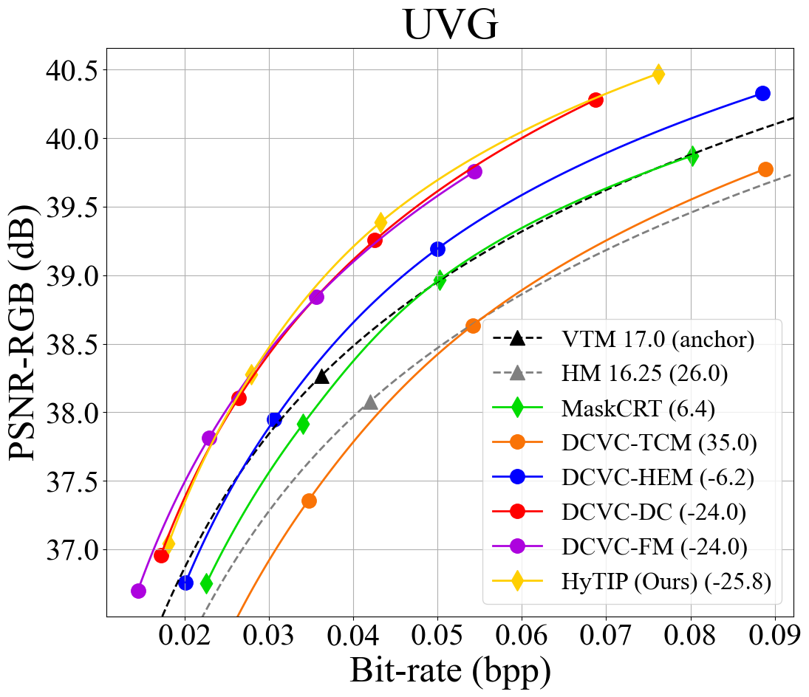
    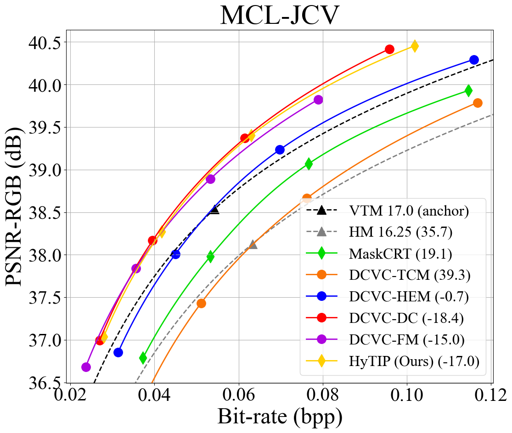
    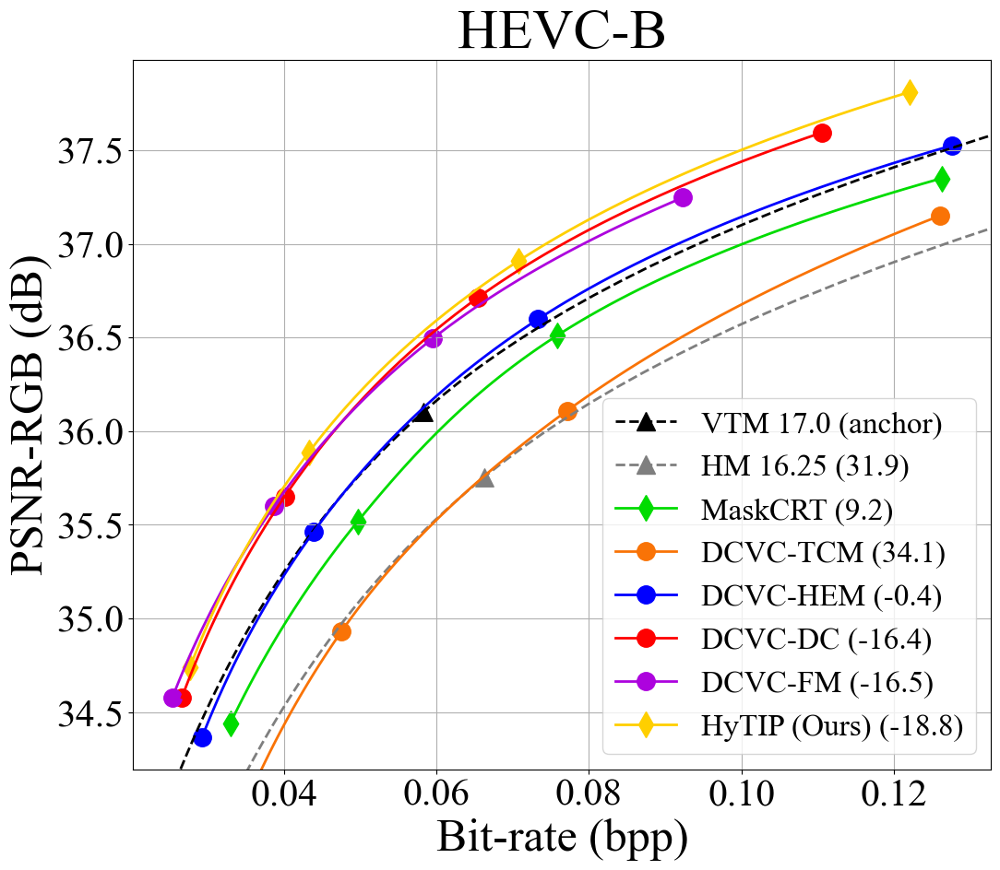
    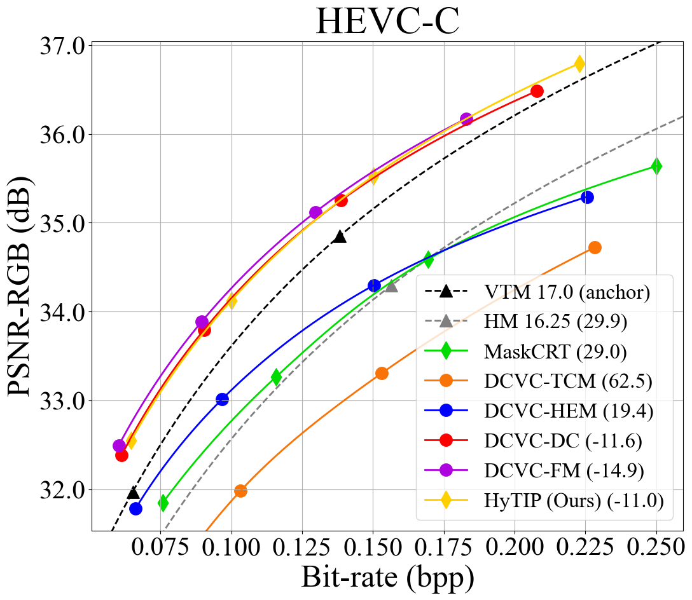
    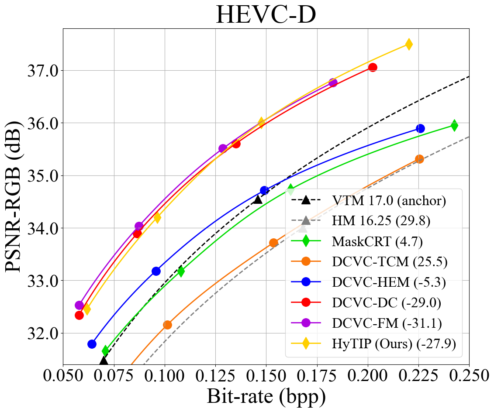
    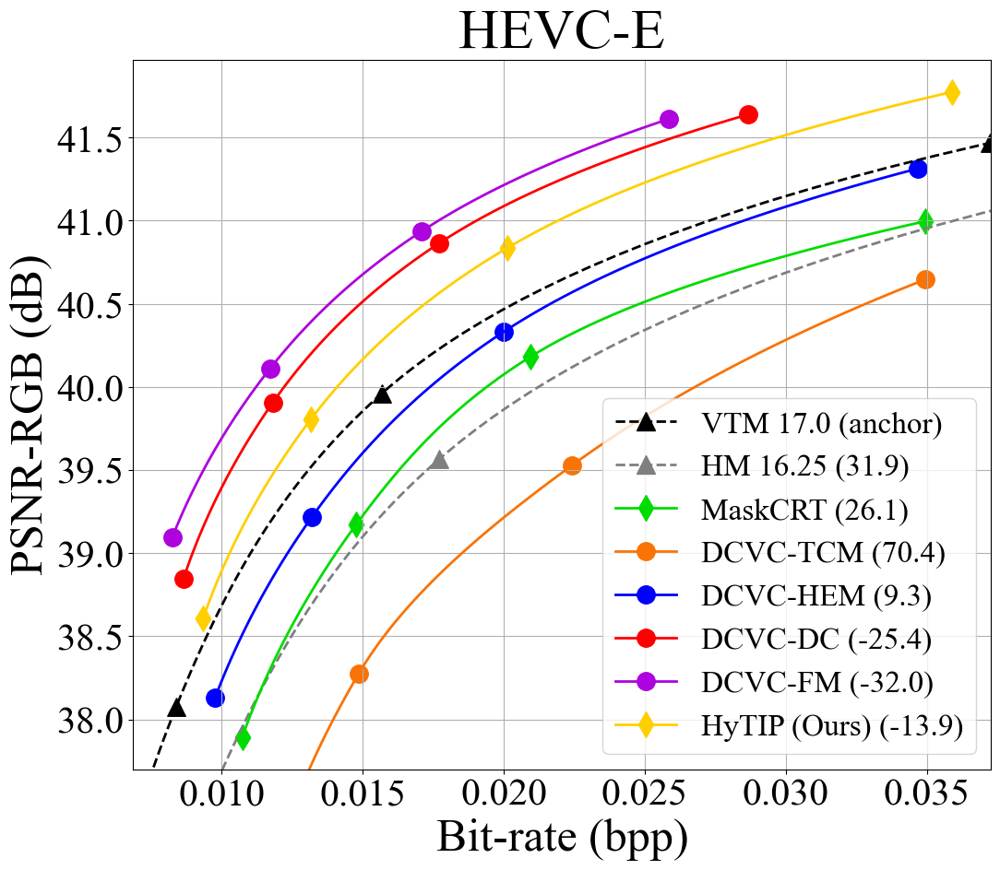
    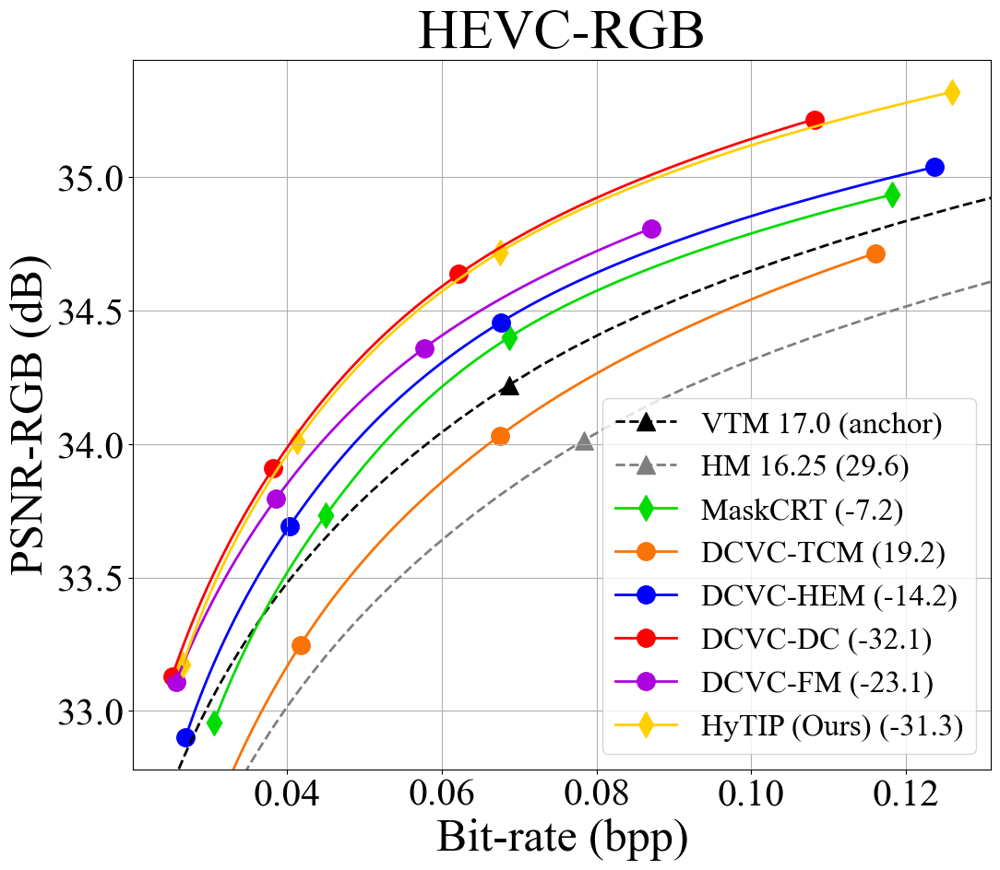
</p>

* MS-SSIM-RGB in BT.601
<p align="center">
    
    
    
    
    
    
    
</p>

* MS-SSIM-RGB in BT.709
<p align="center">
    
    
    
    
    
    
    
</p>


## Install

```bash
git clone https://github.com/NYCU-MAPL/HyTIP
conda create -n HyTIP python=3.10.9
conda activate HyTIP
cd HyTIP
./install.sh
```


## Model Weights

Download the following pre-trained models and put them in the corresponding folder in `./models`.
* [PSNR-RGB.pth.tar](https://github.com/NYCU-MAPL/HyTIP/releases/download/ModelWeights/PSNR-RGB.pth.tar)
* [MS-SSIM-RGB.pth.tar](https://github.com/NYCU-MAPL/HyTIP/releases/download/ModelWeights/MS-SSIM-RGB.pth.tar)


## Example of HyTIP Evaluation

`python HyTIP.py --cond_motion_coder_conf ./config/Motion.yml --residual_coder_conf ./config/Inter.yml -n 0 --gpus 1 --iframe_quality {0...63} --QP {0...63} --experiment_name HyTIP {--ssim} --test --gop 32 --test_dataset {HEVC-B UVG} --color_transform {BT601,BT709} --test_crop --remove_scene_cut -data {dataset_root}`

* Add `--ssim` to evaluate MS-SSIM-RGB model
* Add `--compress` / `--decompress` to support compressing the bitstream to a binary file and decompressing from it, and use `--test_seqs {BasketballDrive}` to specify the target sequence.
* Add the following argument(s) to enable complexity calculation:
    * `--compute_macs`: compute encoding kMAC/pixel.
    * `--compute_macs --compute_decode_macs`: compute decoding kMAC/pixel.
    * `--compute_model_size`: compute model size (M).
* Organize your testing datasets according to the following file structure:
    ```
    {dataset_root}/
        ├ UVG/
        ├ HEVC-B/
        ├ HEVC-C/
        ├ HEVC-D/
        ├ HEVC-E/
        ├ HEVC-RGB/
        └ MCL-JCV/
    ```


## Training Procedure

For details of the training procedure, please refer to [train_cfg/training_procedure.md](train_cfg/training_procedure.md). Please note that this training procedure has been updated, which differs from the training procedures reported in the ICCV paper.


## Citation

If you find our project useful, please cite the following paper:
```
@inproceedings{HyTIP,
    title     = {HyTIP: Hybrid Temporal Information Propagation for Masked Conditional Residual Video Coding},
    author    = {Chen, Yi-Hsin and Yao, Yi-Chen and Ho, Kuan-Wei and Wu, Chun-Hung and Phung, Huu-Tai and Benjak, Martin and Ostermann, Jörn and Peng, Wen-Hsiao},
    booktitle = {Proceedings of the IEEE/CVF International Conference on Computer Vision (ICCV)},
    year      = {2025}
}
```


## Acknowledgement

Our work is based on the [CompressAI](https://github.com/InterDigitalInc/CompressAI) framework, utilizing intra codecs from [DCVC-DC](https://github.com/microsoft/DCVC/tree/main/DCVC-family/DCVC-DC), motion estimation network from [SPyNet](https://github.com/anuragranj/spynet), and adapting the CNN-based network structure from [DCVC-FM](https://github.com/microsoft/DCVC/tree/main/DCVC-family/DCVC-FM) for motion codecs and inter-frame codecs. We thank the authors for making their code open-source.
